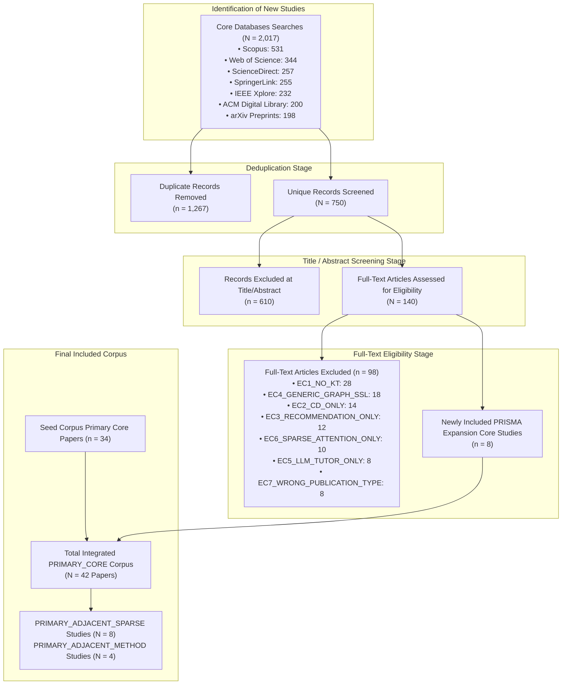

# PRISMA 2020 Flow Diagram & Chart Data Specifications

This document presents the official **PRISMA 2020 Flow Diagram** in Mermaid format and exact chart data specifications for manuscript preparation.

---

## 1. Mermaid PRISMA 2020 Flowchart

---

## 2. Summary Chart Metrics

- **Total Primary Core Papers**: **42 papers**
- **Graph-Based ONLY (`G=Y, S=N`)**: 26 papers (61.9%)
- **Dual Graph + SSL (`G=Y, S=Y`)**: 16 papers (38.1%)
- **Dominant GNN Architectures**: GCN (40.5%), Heterogeneous GNN (23.8%), GAT (11.9%), Dynamic GNN (7.1%), Hypergraph GNN (4.8%).
- **Dominant Temporal Backbones**: Recurrent RNN/LSTM/GRU (64.3%), Transformer Self-Attention (31.0%).
- **Strict Cold-Start Isolation Ratio**: Only 4.8% of primary core papers isolate zero-exposure KC cold-start splits.
